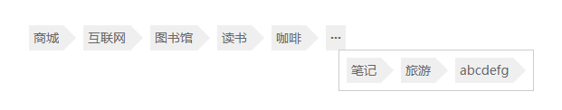

<a href="" target="_blank">直接戳我进行预览哦~</a>

### 使用步骤

1. 首先加载插件，需要用到的文件有tag.js和tag.css文件。
```javascript
<!DOCTYPE html>
<html>
<head>
    ...
    <link rel="stylesheet" href="tag.css">
</head>
<body>
    ...
    <script src="tag.js"></script>
    ...
</body>
</html>
```

2. HTML内容。
```javascript
<div class="tag-wrap">
    <ul class="tag-list clearfix">
	  
	  <!-- 标签列表 -->
      <li>任意标签</li>
	  
    </ul>
  </div>
```
你可以同时拥有多个Tag
```javascript
<!-- 标签组件一 -->
<div class="tag-wrap">
    <ul class="tag-list clearfix">
	  
	  <!-- 标签列表 -->
      <li>任意标签</li>
	  
    </ul>
  </div>
  
  <!-- 标签组件二 -->
  <div class="tag-wrap">
    <ul class="tag-list clearfix">
	  
	  <!-- 标签列表 -->
      <li>任意标签</li>
	  
    </ul>
  </div>
```

3. 你可能想要给Tag定义一个大小，当然不要也行。(默认为350px)
```javascript
.tag-wrap {
  width: 400px;
}
```

4. 初始化Tag。
```javascript
...
<script>        
	 new Tags();
  </script>
</body>
```

5. 完成。恭喜你，现在你的Tag应该已经能正常运行了。